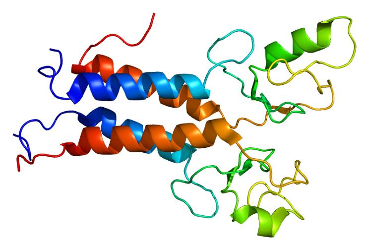
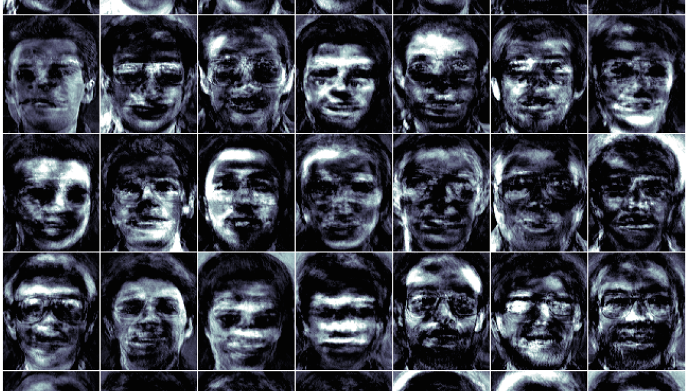
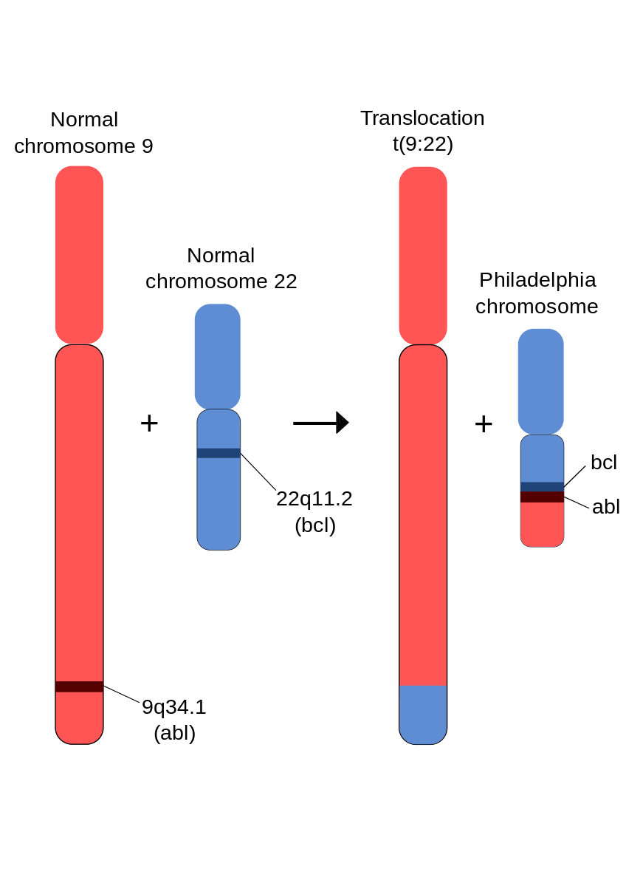

- title : How machine learning helps cancer research
- description : Talk at Oredev
- author : Evelina Gabasova
- theme : white
- transition : none

****************************************************************************************************

# How machine learning helps cancer research

## Evelina Gabasova
## @evelgab
### MRC Cancer Unit, University of Cambridge

********************************************************************************

<table><tr><td class="noborder">
# DNA

</td><td class="noborder">

</td></tr>
</table>

' DNA path – 2.5 km
' 10,000 colored stripes representing BRCA2 gene, one of approx.  30,000 genes in human
' 3 billion BPs
' Whole DNA – 20 times around the Earth

-----------------

# Cost of whole genome sequencing

' The whole area is 15 years old
' Human genome project finished in 2003
' Joint effort of 20 research centres

-----------------

# Sequencing data

' It is projected that soon just the amount of sequencing information we’ll have will be larger than what data astronomy, particle physics processes
' Projected in a couple of years, genomics will have more data than Youtube (300 hours of video are uploaded to YouTube every minute)
' -> challenges – high dimensionality (DNA is HUGE)

-----------------

# DNA and genes

' DNA is stable storage
' Contains genes, each gene encodes a protein
' To synthetize a protein, we need to copy out a piece of DNA
' Explain what is gene expression – crutial part of analysing cells

-----------------

<table><tr><td class="noborder">

   

# Cancer

- Genetic mutations
- Oncogenes and tumour suppressors

   

**BRCA1 and BRCA2 are
chromosome guardians**

   

- Cancer is not a single disease

</td><td class="noborder">

</td></tr>
</table>

' Cancer is a group of diseases, characterized by uncontrolled growth of tissues
' BRCA genes act as guardians during chromosome duplication – repair errors during the duplication
' BRCA2 discovered in 1994
' Cancer ~ bugs in genetic code
' Mutation in gene (change in base pair, malformed protein, different function)
' Find causal mechanisms of cancer - imagine debugging large program in unknown programming
' language, that you can't easily run
' (it's possible to isolate little parts of the system and tweak them in the lab)

****************
<table><tr><td class="noborder">

# Clustering

</td><td class="noborder">  

</td></tr></table>

' Clustering is about finding groups in data, that are more similar within themselves and different across themselves
' Identifying types of cancer, because cancer is not a single disease
' Using gene expression to find subtypes of cancer, that behave differently in different patients

-----------------

<table><tr><td class="noborder">

# Example
## Clustering wholesale customers

440 wholesale customers
    

Annual spending on

- Fresh produce
- Milk products
- Grocery products
- Frozen products
- Detergents and paper
- Delicatessen

</td><td class="noborder">

</td></tr></table>

' Unsupervised algorithm, tries to find patterns in data
' Hotels spend a lot on paper and detergents

-----------------
# Methods for clustering

- k-means clustering
- hierarchical clustering
- spectral clustering
- Gaussian mixture model and other probabilistic methods
- ...

' find gif of k-means or gaussian mixture model

-----------------
# Visualisation of high-dimensional data
## Principal component analysis

-----------------
# Clustering cancer data

*Genes* instead of *customers*

*Gene expression* instead of *spending on products*

' Why would we even want to cluster cancer data?

-----------------
# Conventional medicine

-----------------
# Precision medicine

-----------------

# Clustering in cancer research

TCGA breast cancer 
Clustering 368 tumour samples based on expression of 648 genes.

' Find different sybtypes of cancer
' [DEMO - cluster gene expression data from TCGA]
' Survival analysis

-----------------

# Integrative clustering

-----------------

# Integrative clustering

' how single data in isolation don’t tell much
' Example of what I do
' Identify groups that exist among these different data types.
' Problems: cannot just put the data together, because they measure something different, have to devise more intelligent methods

********************************************************************************

<table><tr><td class="noborder">

# Collaborative filtering

</td><td class="noborder">

 

</td></tr></table>

' What is collaborative filtering

-----------------------

# Example
## The Netflix prize

| User    | Film 1 | Film 2 | Film 3 | Film 4  | ... | Film 1000 |
|---------|--------|--------|--------|---------|-----|-----------|
| Alice   |  5     |  2     |  x     | x       | ... |  4        |
| Bob     |  x     |  1     |  2     | x       | ... |  2        |
| Carol   |  2     |  x     |  3     | *?*     | ... |  3        |
| ...     |  ...   |  ...   |  ...   | ...     | ... |  ...      |
| Zoe     |  x     |  5     |  4     | 5       | ... |  x        |

----------------------

# Matrix factorization

' what methods are used to compute matrix factorisation?

----------------------
# Collaborative filtering of cancer data

*Patients* instead of *users*

*DNA mutations* instead of *film ratings*

-----------------------

# Mutational signatures

| Patient | C/A    | C/G    | C/T    | T/A    | T/C   | T/G   |   
|---------|--------|--------|--------|--------|-----|-----------|
| Alice   |  5     |  2     |  0     | 0      | 3   |  4        |
| Bob     |  0     |  1     |  2     | 0      | 0   |  2        |
| Carol   |  2     |  0     |  3     | 0      | 1   |  3        |
| ...     |  ...   |  ...   |  ...   | ...    | ... |  ...      |
| Zoe     |  0     |  5     |  4     | 5      | 2   |  0        |

' C/T and T/C are associated with environmental damage
' different cancers have different signatures

----------------------
# Matrix factorization to identify features

<table><tr>
<td class="noborder"></td>
<td class="noborder" style="vertical-align:middle"></td>
</tr>
</table>

--------------------

# Matrix factorization to identify features

--------------------

# Matrix factorization to identify features

**************************

<table><tr><td class="noborder">

# Proving system stability

</td><td class="noborder">

</td></tr></table>

------------------------

# Theorem proving
## SAT

(A ∨ ¬B ) ∧ (¬ A ∨ B)

*A = true*  
*B = true*

------------------------

# Theorem proving
## Satisfiability Modulo Theories (SMT)

(A ∨ ¬B ) ∧ (¬ A ∨ B)

((a > 3) ∨ (b < 1)) ∧ ((a < 5) ∨ (b = 0))

*a = 4*  
*b = 0*

' [DEMO]

------------------------

# Software verification
## Z3 theorem prover

<table>
<tr><td class="noborder">Preconditions</td><td class="noborder"></td><td class="noborder"> </td></tr>
<tr><td class="noborder">Postconditions</td><td class="noborder"></td><td class="noborder"> </td></tr>
<tr><td class="noborder">Loop conditions</td><td class="noborder">➜</td><td class="noborder"> <em>SMT formulas</em> </td></tr>
<tr><td class="noborder">Assertions</td><td class="noborder"></td><td class="noborder"> </td></tr>
<tr><td class="noborder">...</td><td class="noborder"></td><td class="noborder"></td></tr>
</table>

------------------

# Software verification
## Spec#

------------------

# Software verification
## Spec#

----------------------
# Proving stability of biological processes

<table><tr><td class="noborder">

Proteins </td><td class="noborder"></td></tr>
<td class="noborder"> Genes </td><td class="noborder"> ➜    *Variables* </td></tr>
<td class="noborder">Receptors </td><td class="noborder"></td></tr>
<td class="noborder"> … </td><td class="noborder"></td></tr>
</table>

<table>
<tr><td class="noborder"></td><td class="noborder">➜</td><td class="noborder"> v + 1</td><td class="noborder">if v < T(v) </td></tr>
<tr><td class="noborder">v </td><td class="noborder">➜</td><td class="noborder"> v </td><td class="noborder">if v = T(v) </td></tr>
<tr><td class="noborder"></td><td class="noborder">➜</td><td class="noborder"> v - 1</td><td class="noborder">if v > T(v) </td></tr>
</table>

[Bio Model Analyser](http://biomodelanalyzer.research.microsoft.com/tool.html?Model=preloaded/SkinModel.json)

' Traditional way to do this is via systems of differential equations
' DNA pathways - inhibition and activation
' Target function T - average effect of inhibitors and activators
' If we can get to the state where v = T(v) for all variables, the system stabilises
' Transform this into SMT formula and find a value of the state
' Iterate until the system stabilises of ends up in a cycle

--------------------------
# Chronic myeloid leukemia

--------------------------
# Proving stability of biological systems
## Chronic myeloid leukemia

' Model constructed from identified interactions from literature
' Relatively simple system because it’s caused by a single change when two chromosomes overlap and exchange parts
' The model correctly corresponds to the currently existing drug targets
' Allows testing what happens when we disable a receptor, or a specific protein
' Turns out the system is remarkably stable, needs disruption of at least two elements

' 54 nodes, 104 interactions, sourced from published literature (160 papers)

*****************************

## Machine learning is not just
## for targeted advertising
## or algorithmic trading

----------------------------

<table>
<tr>
  <td class="noborder"></td>
  <td style="vertical-align:middle" class="noborder"> [@evelgab](https://twitter.com/evelgab)</td>
</tr>
<tr>
  <td class="noborder"></td>
  <td class="noborder" style="vertical-align:middle" > [evelina@evelinag.com](mailto:evelina@evelinag.com)</td>
</tr>
<tr>
  <td class="noborder"></td>
  <td class="noborder" style="vertical-align:middle" > [github.com/evelinag](https://github.com/evelinag)</td>
</tr>
<tr>
  <td class="noborder"></td>
  <td class="noborder" style="vertical-align:middle" > [evelinag.com](http://evelinag.com)</td>
</tr>
</table>

----------------------------

# Links

- [MRC Cancer Unit, University of Cambridge](http://www.mrc-cu.cam.ac.uk/)
- [Big Data: Astronomical or Genomical?](http://journals.plos.org/plosbiology/article?id=10.1371/journal.pbio.1002195)
- [Signatures of mutational processes in cancer](http://www.nature.com/nature/journal/v500/n7463/full/nature12477.html)
- [Z3 prover](https://github.com/Z3Prover)
- [Proving stabilization of biological systems](http://research.microsoft.com/en-us/um/cambridge/projects/terminator/biocheck11-final.pdf)
- [Bio Model Analyser](http://biomodelanalyzer.research.microsoft.com/)
- [Drug target optimization in Chronic Myeloid Leukemia using innovative computational platform](http://research.microsoft.com/apps/pubs/default.aspx?id=226356)

<table><tr>
<td class="noborder"></td>
<td class="noborder"></td>
</tr></table>
